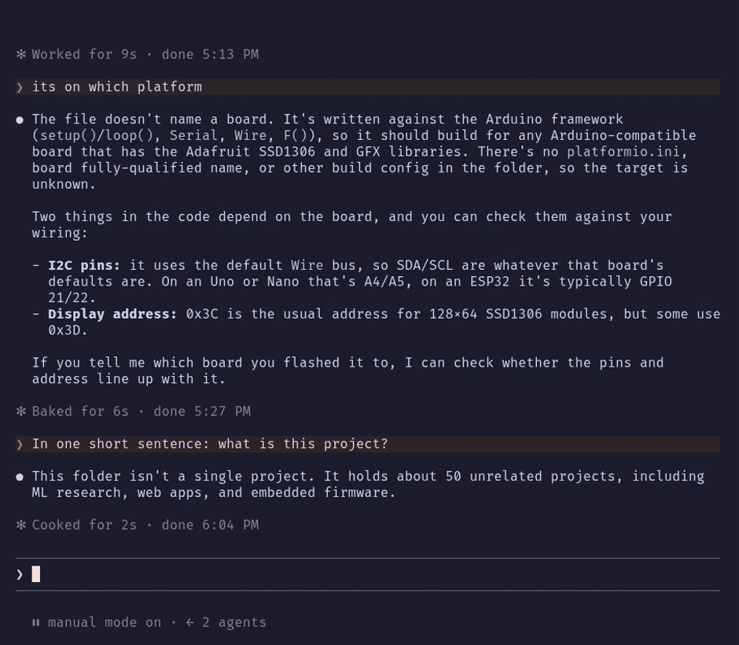

**Keep Claude Code's prompt cache warm while you're away.**

[](https://github.com/404Mayank/cachebeat/actions/workflows/ci.yml)
[](https://code.claude.com/docs/en/plugins/mods/overview)
[](LICENSE)



When a Claude Code session sits idle, its prompt cache expires, and your next message has to rebuild it from scratch. That's slower, and it uses more of your usage limits. cachebeat gives the session a heartbeat: shortly before the cache would expire, it sends a tiny background request that reads the conversation and keeps the cache alive. Your transcript never sees it.

You come back from lunch, type your next message, and it picks up right where you left off.

## Features

- **Background beats** keep the cache warm while you're idle and stay out of the conversation
- **A live heart** under the prompt, with 19 animations to choose from
- **A status line** under your latest turn shows the beats so far and the time until the next one
- **A settings menu** with live previews, driven by keyboard or mouse
- **Safety stops** for long idle stretches, usage limits, errors, and chats too small to bother with
- **Per session or everywhere**: turn it on for one session, or have every new session start with it

## Requirements

- **Claude Code 2.1.287 or later.** Check your version with `claude --version` and update with `claude update`.
- A terminal. The heart, status line and settings menu are drawn in the terminal, so they don't show in the desktop app or in `claude -p`.

## Install

In your terminal:

```sh
claude plugin marketplace add 404Mayank/cachebeat
claude plugin install cachebeat@cachebeat
```

Or from inside Claude Code:

```
/plugin marketplace add 404Mayank/cachebeat
/plugin install cachebeat@cachebeat
/reload-plugins
```

If `/cachebeat` isn't there afterwards, restart Claude Code.

**Update:** `claude plugin marketplace update cachebeat`, then `claude plugin update cachebeat@cachebeat`, then restart Claude Code.

**Uninstall:** `claude plugin uninstall cachebeat@cachebeat`, then `claude plugin marketplace remove cachebeat`.

## Quick start

In any session:

```
/cachebeat on
```

The heart appears under the prompt, and after your next turn it starts beating. To have every new session start with it on:

```
/cachebeat global on
```

Beats come every 50 minutes, to fit the one-hour cache of a Claude subscription. With an API key, a cloud provider, or usage credits, the cache lasts five minutes, so beat under that: `/cachebeat 4` for this session, or set **Beat after idle** to 4 in `/cachebeat settings` to make it the default.

## What it sends, and what it costs

Each beat is one small request to the Anthropic API, made the way Claude Code makes its own requests: it carries the current conversation and asks for a one-character reply. The reply is thrown away, and nothing is added to your transcript.

- A beat counts toward your usage like any other request. Because it reads from the cache, it costs far less than rebuilding the cache would.
- Beats happen only while the session is idle, at most once per interval (50 minutes by default).
- cachebeat sends nothing anywhere else. It has no telemetry and makes no other network calls.

## Commands

| Command | What it does |
| --- | --- |
| `/cachebeat` | Shows the status: on or off, the interval, beats so far, the next beat |
| `/cachebeat on` | Turns it on for this session |
| `/cachebeat off` | Turns it off for this session |
| `/cachebeat <minutes>` | Turns it on with a different interval, e.g. `/cachebeat 30` (1–55) |
| `/cachebeat now` | Beats right away |
| `/cachebeat global on` / `off` | Sets whether new sessions start on, and applies it here too |
| `/cachebeat settings` | Opens the settings menu |

## What you'll see

**The heart** sits at the end of the hint line under the prompt, with the beat count beside it. It beats while a beat is scheduled, bursts when one lands, and holds still while it waits for your next turn.

**The status line** sits under your latest turn. Before the first beat it reads `♡ next beat in 50m`, and after that `♥ cache kept warm ×3 · next in 42m`. When you send a new message, the line moves down to the new turn.

```
✻ Cogitated for 12s · done 3:09 PM

♥ cache kept warm ×3 · next in 42m

❯
  ⏸ manual mode on · ⠀(♥)⠀ ×3
```

## Settings

Open the menu with `/cachebeat settings`. Settings are saved once and apply to every session.

- On the tab bar, ↑↓ switch tabs and Enter goes into one. 1–5 jump straight into a tab.
- Inside a tab, ↑↓ move between settings, and Enter changes one or opens its list of choices.
- In a list, ↑↓ preview each choice and Enter picks it.
- Esc goes back one step, and closes the menu from the tab bar.
- The mouse works too: click to pick, scroll to scroll.

Settings with numbers also take a custom value at the bottom of their list, such as `35` minutes, `90m`, or `35k` tokens.

<details>
<summary><b>Beating</b>: when beats happen and when they stop</summary>

| Setting | What it does | Default |
| --- | --- | --- |
| This session | Turns beating on or off right here | off |
| New sessions start | Whether new sessions start with it on | off |
| Beat after idle | How long the session sits idle before a beat | 50 minutes |
| `/cachebeat <min>` sets | Whether `/cachebeat 30` changes this session only, or the default for all | this session |
| Stop after idle | Stops beating after this long without a message from you | 8 hours |
| Stop at usage | Stops once any of your usage limits reaches this percentage | 100% |
| Skip small contexts | Skips beating chats under a minimum size | off, 20k tokens |

With **Skip small contexts** on, cachebeat tells you up front when a chat is under your minimum, once in the log and in the status line: `♡ beats skip · this chat is 38k tokens, under your 50k minimum`. It starts beating as soon as the chat grows past the minimum.

</details>

<details>
<summary><b>Heart</b>: 19 animations, speed and timing</summary>

| Setting | What it does | Default |
| --- | --- | --- |
| Animation | Which of the 19 animations the heart plays | Classic |
| Animate | Turns the animation on or off | on |
| Speed | Slow, normal, fast, or a custom frame time | normal |
| Timing | Linear plays evenly; lub-dub beats twice, then rests | linear |
| Placement | At the end of the hint line, or on its own line below it | hint line |
| Beat count | Shows the `×3` beside the heart | on |

The Animation list plays every animation at once, so you can watch them side by side before you pick. Linear suits the line animations, and lub-dub suits the hearts.

The animations are Classic, Pulse, Triplet, Sparkle, Fleuron, Wave, ECG, Beam, Dash, Sine, Charge, Converge, Twins, Orbit, Static, Garland, Equalizer, Cupid and Bounce.

```
Classic    ⋅ ♡ ⋅            ECG     ─⎼⎺⎽────⎼⎺⎽───♥
Sparkle    ✦ ♥ ✦            Sine    ⠒⠉⠒⠤⣀⠤⠒⠉⠒⠤⣀⠤⠒⠉❤︎
Orbit       •♥              Cupid       ─➤ ♡
```

</details>

<details>
<summary><b>Look</b>: color and effect</summary>

| Setting | What it does | Default |
| --- | --- | --- |
| Color | Dim, a color from your theme, a preset, or any hex color | dim |
| Effect | Steady; flash on each beat; flow, a shimmer sweeping across; or mixed, which switches between them | steady |

Theme colors follow your Claude Code theme, so they change when you switch themes. A heart at the end of the hint line is always dim; put it on its own line to give it color. The status line takes the color either way.

</details>

<details>
<summary><b>Status</b>: the line under your latest turn</summary>

| Setting | What it does | Default |
| --- | --- | --- |
| Placement | Under the turn after a blank line, directly under it, or off | after a blank line |
| Countdown | Shows the time to the next beat | on |
| Tokens kept | Shows how much the last beat kept warm, e.g. `· 184k cached` | off |

</details>

<details>
<summary><b>Alerts</b>: how beats and stops are announced</summary>

| Setting | What it does | Default |
| --- | --- | --- |
| On a beat | Log, toast, both, or nothing when a beat lands | nothing |
| On stop | Log, toast, both, or nothing when beating stops by itself | log |

</details>

## When it stops on its own

cachebeat turns itself off for the session when:

- you haven't sent a message for longer than **Stop after idle**
- a usage limit reaches **Stop at usage**
- the API rate-limits it, or returns an error that doesn't clear up (a passing hiccup is retried a minute later)
- the cache is already gone, so there's nothing left to keep warm

It tells you why, the way you chose under **Alerts**.

## Good to know

- Sending a message restarts the countdown.
- `/clear` starts a fresh conversation: the count goes back to zero, and beats resume after your first message.
- `/cachebeat now` needs at least one turn in the session, since before that there's nothing cached to keep warm.
- Settings you change in one session reach your other open sessions at their next turn.

## Contributing

Ideas, bug reports and pull requests are all welcome: a new heart animation, a setting you'd find useful, or a fix. Open an issue to talk something through, or send a PR straight away.

To work on it, clone the repo and start Claude Code with it loaded. Your edits reload in the running session:

```sh
git clone https://github.com/404Mayank/cachebeat.git
cd cachebeat
claude --plugin-dir .
```

Before sending a change:

```sh
claude plugin validate --strict .   # checks the plugin the way Claude Code loads it
claude plugin test .                # runs the test suite
npx -p typescript tsc -p .          # type-checks, once Claude Code has loaded the plugin
```

CI runs the same checks on Claude Code 2.1.287 and the latest release. Raising `version` in `.claude-plugin/plugin.json` and merging to `main` publishes a new release.

| File | What's in it |
| --- | --- |
| `hooks/register.tsx` | Scheduling, beats, commands, and what's drawn on screen |
| `hooks/animations.ts` | The animations and their timing |
| `hooks/settings.ts` | Settings, defaults, colors and effects |
| `hooks/pane.tsx` | The settings menu |
| `hooks/cachebeat.test.tsx` | Tests |
| `assets/demo.py`, `assets/demo.tape` | Record the demo GIF with [VHS](https://github.com/charmbracelet/vhs) and fast-forward its idle stretches |

A new animation is a single entry in `hooks/animations.ts`: a loop and a burst, each written as frames separated by `|`.

## License

[MIT](LICENSE)
